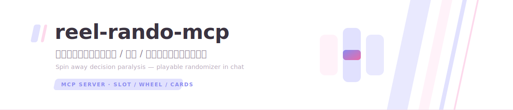

<div align="center">

<picture>
  <source media="(prefers-color-scheme: dark)" srcset=".github/assets/banner-dark.svg">
  
</picture>

[](https://github.com/asashiki/reel-rando-mcp/actions/workflows/ci.yml)
[](LICENSE)


**English** · [简体中文](README.zh-CN.md)

</div>

# reel-rando-mcp

An MCP server that turns "just pick one for me" into a playable moment. Instead of the AI listing options and leaving the choice to you, it drops a **slot machine**, **spinning wheel**, or **card draw** widget right into the chat — you click, fate decides.

> 「中午吃什么?」 → AI puts 麻辣烫 / 寿司 / 沙县 / 汉堡 into a slot machine → you pull the lever → 🎰 寿司. Decision paralysis solved, with style.

## How it works

- The AI calls **`spin_picker`** with 2–12 options (plus optional `title` and `mode`).
- The server decides the outcome **server-side** (`crypto.randomInt`) and returns it in `structuredContent`, together with instructions telling the AI **not to spoil the result** until you've spun.
- The chat renders a `ui://` MCP Apps widget (claude.ai & ChatGPT web): you interact, the animation lands on the predetermined result, both you and the AI agree on what fate chose.

## Modes

| Mode | Best for | Interaction |
|---|---|---|
| `slot` (default) | any count | vertical reel with idle scroll, big SPIN button, 7-loop deceleration |
| `wheel` | 3–8 options | SVG sector wheel, GO hub, 5-turn ease-out spin with pointer |
| `cards` | 2–6 options | face-down card fan, tap one to flip — the rest reveal after |

All three share the Asashiki sakura design language (light/dark aware) and a RESULT footer with the draw id.

## Tool

`spin_picker`

```jsonc
{
  "title": "今天中午吃什么",      // optional, ≤40 chars
  "options": ["麻辣烫", "寿司", "沙县", "汉堡"],  // 2-12 short labels
  "mode": "slot"                  // optional: slot | wheel | cards
}
```

Returns `structuredContent`: `{ title, options, mode, resultIndex, resultLabel, drawId, createdAt }`.

## Quick start

```bash
npm install
npm run build
npm start            # Streamable HTTP on :3000 (/mcp/reel, /mcp alias, /healthz)
# or for Claude Desktop:
npm run start:stdio
```

### Claude Desktop (stdio)

```json
{
  "mcpServers": {
    "reel-rando": {
      "command": "node",
      "args": ["path/to/reel-rando-mcp/dist/stdio.js"]
    }
  }
}
```

## Remote deployment (claude.ai / ChatGPT web)

1. `cp .env.example .env`, set `PUBLIC_BASE_URL` (and `ALLOWED_ORIGINS`).
2. `docker compose up -d`.
3. Reverse-proxy `https://your-domain/mcp/reel` → container `:3000`.
4. Add a custom connector in claude.ai with that URL. OAuth fields stay empty.

The widget loads zero external resources (no fonts, no images, no API calls), so the CSP allowlist is empty and there is nothing else to proxy.

> Hosts cache `ui://` resources by URI. After widget changes, bump the version in `src/widget/reel-widget-html.ts` (`widget-v1.html` → `v2` ...).

## Configuration

| Variable | Default | Meaning |
|---|---|---|
| `PUBLIC_BASE_URL` | _(empty)_ | Public HTTPS origin (used for healthz reporting + CORS default). |
| `PORT` | `3000` | HTTP port. |
| `MCP_HTTP_PATH` | `/mcp/reel` | Streamable HTTP MCP route. |
| `ALLOWED_ORIGINS` | PUBLIC_BASE_URL origin | CORS allowlist, comma separated. |

## Development

```bash
npm run dev          # HTTP server with reload
npm run typecheck
npm run build        # server (tsup) + widget (IIFE inlined into the ui:// resource)
```

## License

MIT
